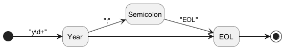
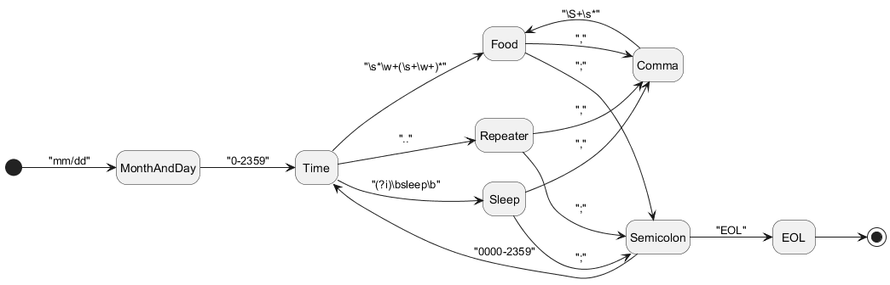

# Food Interpreter
The purpose of the Food Interpreter is to allow users to easily add Foods that they've eaten into a text file, and use the interpreter to create a graph with details of what they've eaten throughout their recorded lifetime. This is to help users learn what habits they have with their food intake, the nutrients and quantities they ingest, find a pattern of potential IBS triggering foods, and much more. It is currently in progress with the lexer and tests, and test pipeline completed.

## Language
The input language is as follows below.  
Year:  
  
Days:  
  
Comments:  
  

## Usage
To run this project locally, install your choice of containerization tool such as Docker Desktop on your machine and run the following commands,
```
docker compose build
docker run -it -p 8080:8080 food-interpreter
```
You can now run it by hitting the endpoint like this,
```bash
curl -d '{"diary": "1/2 345 abc def ghi"}' http://localhost:8080/lexer
```
Which will produce the output,
```json
[{"TokenType":2,"Lexeme":"1/2"},{"TokenType":3,"Lexeme":"345"},{"TokenType":4,"Lexeme":"abc"},{"TokenType":4,"Lexeme":"def"},{"TokenType":4,"Lexeme":"ghi"}]
```

## Planned Features
- Variables/templates, Output/BMs, Excercise

## TODO Features
- Syntax Analysis
- Semantic Analysis
- Code generation
- Graph creation
